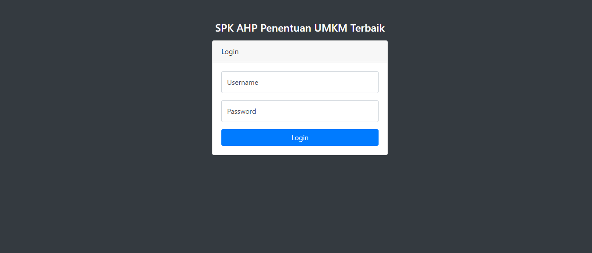
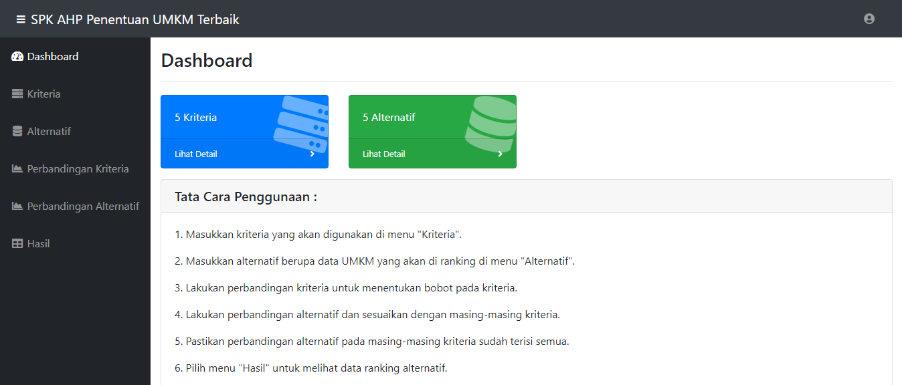
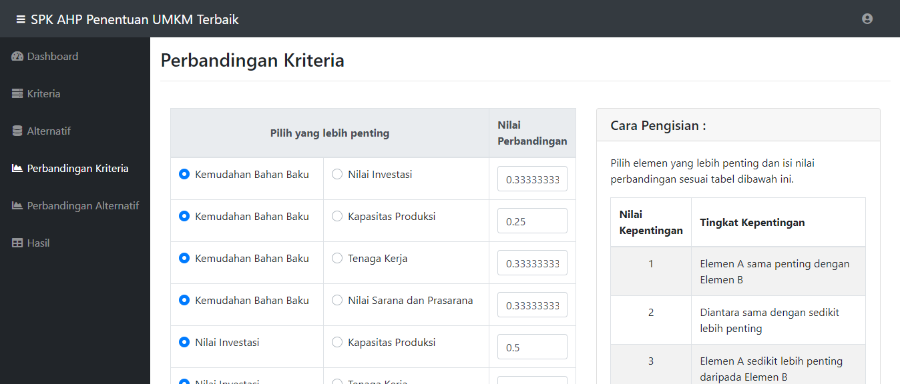
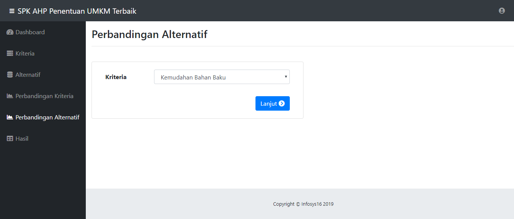

# SPK Penentuan UMKM Terbaik

Sistem Pendukung Keputusan (SPK) Penentuan UMKM Terbaik merupakan tugas project untuk memenuhi persyaratan kelulusan pada mata kuliah Sistem Pendukung Keputusan. Sistem ini dibangun dengan metode AHP dan data training berupa dataset UMKM di Kota Bogor.

### Screenshot
<pre>
                    
</pre>

### Fitur Sistem
* [x] Fitur login.
* [x] Halaman Beranda untuk menampilkan tata cara penggunaan sistem.
* [x] Halaman Kriteria untuk melakukan proses CRUD data kriteria.
* [x] Halaman Alternatif untuk melakukan proses CRUD data alternatif.
* [x] Halaman Perbandingan Kriteria untuk melakukan perbandingan pada setiap kriteria.
* [x] Halaman Perbandingan ALternatif untuk melakukan perbandingan terhadap setiap alternatif.
* [x] Halaman Hasil Perhitungan untuk melihat hasil perankingan pada data alternatif.

### Demo
Link website : Coming Soon  
Untuk database, username dan password, hub : triagung128@gmail.com

   

## Author
• **Tri Agung Susilo** <><> Dont for get to Follow and ★ Star
